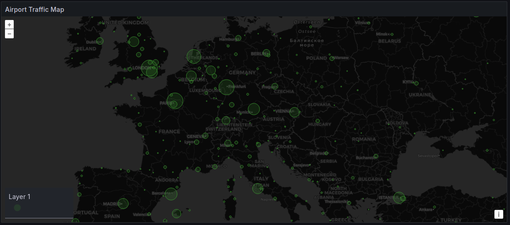
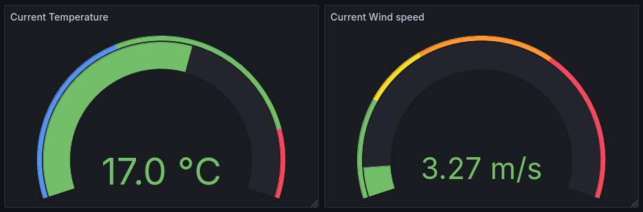

# business-intelligence-hw

## Tartalom

[TOC]

## Infrastruktúra

A projekt minden komponense egy docker compose file-ban van leírva, melyet egyszerűen el lehet indítani az alábbi paranccsal:

```shell
docker compose up
```

Az egész projekt úgy lett elkészítve, hogy monden szükséges függőség szerepel a repository-ban. A grafana dashboard-ok, datasource definíciók automatikusan a konténer létrejöttével létrejönnek így belépés után azok egyből láthatóak, használhatóak.
Egyetlen manuális része a Nifi ProcessGoup-ok importálása illetve az mysql adatbázis kapcsolat jelszavának illetve az InfluxDB bucket tokenjének a megadása. Sajnos ezeket az adatokat nem exportálja ki a Nifi, így sajnos azokat kézzel kell megadni, viszont minden információ elérhető a `compose.yml` file-ban.

A projekt több komponensből áll, melyeket az alábbi fejezetekben fejtek ki. Mivel a házifeladat célja nem a biztonság hanem egy BI rendszer szimulálása ezért egyszerű jelszavakat használtam melyek a `compose.yml` file-ból kiolvashatóak teszteléshez.

Komponensek elérhetőségei, röviden:
- mysql: localhost:3306
  - root
  - pass
- influxdb: http://localhost:8086
  - admin
  - pass12345678
- grafana: http://localhost:3000
  - admin
  - pass
- nifi: https://localhost:8443/nifi/login
  - admin
  - pass123456789

### mysql

A statikus adatok tárlolására MySQL adatbázist használtam. Elindulást követően a tőle függő komponensek csak akkor indulnak el ha a konténer egészséges állapotba kerül.
A konténer léterötte közben az Adatbázis séma automatikusan létrejönnek, melyek a `mysql/load.sql` file-ban elérhetőek. Kikommentezve benne található közvetlen CSV file-ból betöltés melyek a séme létrehozása közben használtam, így gyorsabban elő tudtam készíteni a sémát a későbbiekre.

Hasznos információk:
- Adatbázis neve: **bihw**
- Root user neve: **root**
- Root user jelszava: **pass**
- Port szám: **3306**

### influxdb

Az időalapú adatokat InfluxDB-ben (v2) tároltam. Ebben jelen esetben az időjárás adatok szerepelnek amelyeket az API-ból lekérdezünk. Elindulást követően a tőle függő komponensek csak akkor indulnak el ha a konténer egészséges állapotba kerül.

Hasznos információk:
- Admin felhasználónév: **admin**
- Admin jelszó: **pass12345678**
- Szervezet/Organisation: **bihw**
- Bucket: **bihwb**
- Admin token integrációhoz: **mysecretadmintoken**

### grafana

Az adatok megjelenítéséhez Grafana-t használtam. Ő képes nem csak statikus de dinamikus kimutatásokat létrehozni, kezelni amely számomra tökéletes megoldás volt. Két kimutatás készítettem el a `Airports` és `Weather` dashboard-okat.
A konténer létrejötte közben a `Datasrouce` és `Dashboard` objektumok automatikus létrejönnek így a belépést követően semmi konfigurációra nincs szükség.

- Datasource definíció: `grafana/config/datasources.yaml`
- Dashboard provisioner definíció: `grafana/config/dashboard_provisioner.yaml`
- Dasboard definíciók (airports & weather): `grafana/dashboards/`

#### Airports dashboard

Ez a kimutatás a Reptéradatokkal kapcsoaltos, statikus adatokat mutatja be. A rajta található paneleket a következő fejezetek mutatják be.
A dashboard tartalmaz egy **Airport Count** (`airport_count`) változót mely adott, előre meghatározott értékeket képes felvenni (10, 50, 100, ...). Ezt az adott panelekben használtam fel annak érdekében hogy csak a számunkra szükséges mennyiségű adatot láthassuk. Természetesen lehetőség van az összes adat megjelenítéséhez.

##### Panel: Airport Traffic Map



Lekérdezés:
```sql
SELECT
  a.latitude,
  a.longitude,
  a.name AS airport_name,
  COUNT(r.id) AS flight_count
FROM
  bihw.airports a
  LEFT JOIN bihw.routes r ON a.id = r.source_airport_id
GROUP BY
  a.latitude,
  a.longitude,
  a.name
ORDER BY
  flight_count DESC
LIMIT
  ${airport_count}
```

Térkép nézet mely az top N legnagyobb repteret vizualizálja, ahol N az `airport_count` és ahol a legnagyobb az azt jeletni, hogy mennyi járatnak a kiinduló reptere az adott reptér.
> Feltételeztem, hogy ha több járatnak az egyik (jelen esetben kiinduló végében) szerepel a reptér, úgy a reptér mérete is nagyobbnak tekinthető.

A körök nagysága szemlélteti a repterek méretének arányát a többi reptérhez képest.

##### Panel: Airport count by country


Lekérdezés:
```sql
SELECT 
    a.country AS country,
    COUNT(*) AS airport_count
FROM 
    bihw.airports a
GROUP BY 
    a.country
ORDER BY 
    airport_count DESC
LIMIT ${airport_count}
```

Az első N legtöbb reptérrel jelentkező országot mutatja be, ahol N az `airport_count`.

Itt alkalmaztam színezést is amely a bal alsó sarokban látható színezést rendeli az értékekhez.

##### Panel: Top 15 popular airplanes


Lekérdezés:
```sql
SELECT 
    p.name AS aircraft_name,
    r.equipment AS aircraft_type,
    COUNT(*) AS usage_count
FROM 
    bihw.routes r
JOIN 
    bihw.planes p
ON 
    r.equipment = p.iata_code
WHERE 
    r.equipment IS NOT NULL
GROUP BY 
    p.name, r.equipment
ORDER BY 
    usage_count DESC
LIMIT 15;
```

A top 15 legsűrűbben használt repülőgépeket vizualizálja amit replülőjáratokban használnak.

##### Panel: Top 15 most popular airports


Lekérdezés:
```sql
SELECT 
    a.name AS airport_name,
    r.source_airport AS airport_id,
    COUNT(*) AS flight_count
FROM 
    bihw.routes r
JOIN 
    bihw.airports a
ON 
    r.source_airport_id = a.id
GROUP BY 
    r.source_airport, a.name
ORDER BY 
    flight_count DESC
LIMIT 15;
```

A top 15 legnépszerűbb reptér melyek a járatok kiindulási pontjaként jelennek meg a járatokban.

##### Panel: Top 15 most popular route sources and destinations


Lekérdezés:
```sql
SELECT 
    sa.country AS "Source country",
    da.country AS "Destination country",
    COUNT(*) AS "Flight count"
FROM 
    bihw.routes r
JOIN 
    bihw.airports sa ON r.source_airport_id = sa.id
JOIN 
    bihw.airports da ON r.destination_airport_id = da.id
GROUP BY 
    sa.country, da.country
ORDER BY 
    3 DESC
LIMIT 15;
```

Top 15 olyan járat melyek az adott kiinduló és cél repterek között legtöbb létezik.

##### Panel: Distribution of plane brands


Lekérdezés:
```sql
SELECT 
	SUBSTRING_INDEX(p.name , ' ', 1) AS Brand,
	count(*) AS "Count"
FROM planes p 
GROUP BY Brand
ORDER by 2 DESC
```

Repülőgép márkák megoszlása melyeket a járatokban használnak.

##### Panel: Distribution of airline status


Lekérdezés:
```sql
SELECT
	a.active AS "Status",
	count(*)
FROM airlines a
GROUP BY a.active
```

Légitársaságok státuszának a megoszlása.

#### Weather dashboard

A kimutatás a repterekkel kapcsolatos időjárásokat mutatja be melyek dinamikus adatok. Ezeket az InfluxDB-ből vannak lekérdezve.
A dashboard tartalmaz egy **City** (`city`) változót mellyel kiválasztható hogy mely városban lévő reptér adatait szeretnénk megjeleníteni. Lehetőség van az összes település megjelenítéséhez.

A dashboard-ban Row-onként vannak rendezve az egyes települések kimutatásai, melyek template-esen vannak megjelenítve. Ez azt jelenti, hogy a `city` változóba az összes elérhető város neve be lesz töltve amint a kimutatásra navigálunk az alábbi lekérdezés segítségével:
```
from(bucket: "bihwb")
  |> range(start: v.timeRangeStart, stop: v.timeRangeStop)  // Az időtartomány szűrése
  |> filter(fn: (r) => r["_measurement"] == "weather")  // Csak a "weather" mérés adatai
  |> group(columns: ["city"])  // A "city" tag szerint csoportosít
  |> distinct(column: "city")  // Az egyedi városnevek kigyűjtése
  |> sort(columns: ["city"], desc: false)  // Az eredmény városnév szerint rendezve
  |> yield(name: "unique_cities")  // Eredmény elnevezése
```
Így attól függően, hogy milyen időintervallum van kiválasztva mindig csak az akkor elérhető települések lesznek felsorolva.


##### Panel: Temperature


Lekérdezés:
```
from(bucket: "bihwb")
  |> range(start: v.timeRangeStart, stop: v.timeRangeStop)
  |> filter(fn: (r) => r["_measurement"] == "weather")
  |> filter(fn: (r) => r["city"] == "${city}")
  |> filter(fn: (r) => r["_field"] == "temp" or r["_field"] == "feels_like" or r["_field"] == "temp_min" or r["_field"] == "temp_max")
  |> aggregateWindow(every: v.windowPeriod, fn: last, createEmpty: false)
  |> yield(name: "last")
```

##### Panel: Pressure


Lekérdezés:
```
from(bucket: "bihwb")
  |> range(start: v.timeRangeStart, stop: v.timeRangeStop)
  |> filter(fn: (r) => r["_measurement"] == "weather")
  |> filter(fn: (r) => r["_field"] == "pressure")
  |> filter(fn: (r) => r["city"] == "${city}")
  |> aggregateWindow(every: v.windowPeriod, fn: last, createEmpty: false)
  |> yield(name: "last")
```

##### Panel: Humidity


Lekérdezés:
```
from(bucket: "bihwb")
  |> range(start: v.timeRangeStart, stop: v.timeRangeStop)
  |> filter(fn: (r) => r["_measurement"] == "weather")
  |> filter(fn: (r) => r["_field"] == "humidity")
  |> filter(fn: (r) => r["city"] == "${city}")
  |> aggregateWindow(every: v.windowPeriod, fn: last, createEmpty: false)
  |> yield(name: "last")
```

##### Panel: Current Temperature & Current Wind Speed



Lekérdezés (Temperature):
```
from(bucket: "bihwb")
  |> range(start: v.timeRangeStart, stop: v.timeRangeStop)
  |> filter(fn: (r) => r["_measurement"] == "weather")
  |> filter(fn: (r) => r["city"] == "${city}")
  |> filter(fn: (r) => r["_field"] == "temp")
  |> aggregateWindow(every: v.windowPeriod, fn: last, createEmpty: false)
  |> yield(name: "last")
```

Lekérdezés (Wind speed):
```
from(bucket: "bihwb")
  |> range(start: v.timeRangeStart, stop: v.timeRangeStop)
  |> filter(fn: (r) => r["_measurement"] == "weather")
  |> filter(fn: (r) => r["city"] == "${city}")
  |> filter(fn: (r) => r["_field"] == "wind_speed")
  |> aggregateWindow(every: v.windowPeriod, fn: last, createEmpty: false)
  |> yield(name: "last")
```

Hőmérséklet színskálával van jelölve az alábbiak szerint:
- <0 celsius fok: **kék** (fagyási sáv)
- 0< & <40 celsius fok: **zöld**, átlagos hőmérséklet
- <40 celsius fok: **piros**, nagyon meleg

A szél sebességét a hurrikán szélsebességének bekategorizálásához használt táblázat adatait használtam fel.

###### Row repeate

A sorok összecsukhatóak és a `city` változó értéke szerint ismétlődik és mindig az adott város adatait jeleníti meg.


### nifi

ETL motornak Nifi-t használtam. Eleinte meggyűlt vele a bajom mivel semmi ehhez fogható szoftverrel nem találkoztam. Ugyan időbe telt a használtata viszont a végére minden ment mint a karikacsapás. Meg kell jegyeznem hogy szerintem látszódik hogy az elkészített két ETL folyamat életem első ilyen ETL folyamatai. Ezzel arra célzok, hogy nem feltétlen tökéletesek, optimálisak viszont a feladatukat tökéletesen elvégzik. Itt látom az egész házifeladatban a legnagyobb továbbfejlesztési, optimalizációs potenciált.

A konténer létrehozásakor a szükséges MySQL driver (`nifi/drivers/`) illetve az InfluxDB processzorok (`nifi/processors/`) automatikusan települnek, importálódnak így azokat nem kell konfigurálni.
A Nifi alapvetően nem tatalmaz processzorokat InfluxDB kezelésére ezért egy csomagot kellett letöltenem és beimportálnom.

Két ETL folyamatot készítettem el melyek betöltik a statikus Reprér adatokat CSV file-okból, melyek a konténerrel vannak mount olva, illetve az Időjárás adatokat melyeket REST API híváson keresztül ér el a rendszer.
Sajnos ezekre nem találtam auto betöltési módszert, így ezeket kézzel kell beimportálni a rendszerbe.

#### Reptér adatok betöltése

Process Group file: `nifi/process_groups/LoadOpenflightsData.json`

**Áttekintés**
Ez a NiFi process group az Openflights adatok betöltését végzi MySQL adatbázisba. A folyamat során adattisztítást és transzformációkat is alkalmazunk.
A folyamat biztosítja az adatok minőségi ellenőrzését és átalakítását a MySQL adatbázis számára, miközben minimalizálja az emberi hibalehetőségeket és automatizálja a betöltési folyamatot.

**Adattisztítás és transzformációk**:
1. Hiányzó mezők kezelése:
   callsign, iata, alias mezők automatikus generálása amennyiben azok hiányoznak.

2. Adatszűrés:
   Csak pozitív ID értékekkel rendelkező rekordokat tart meg.

3. Formátumok egységesítése:
   A CSV-t JSON formátumba konvertálja az egyszerűbb feldolgozás érdekében.

##### ListFile: "List airline.dat file"

    Feladata: Fájllista előállítása az /raw_data könyvtárból a .dat kiterjesztésű fájlok alapján.
    Fontos beállítások:
        Input Directory: /raw_data
        File Filter: .*.dat$
        Recurse Subdirectories: true

##### FetchFile: "Fetch airlines.dat file content"

    Feladata: A ListFile által generált fájlok tartalmának beolvasása.
    Fontos beállítások:
        File to Fetch: /raw_data/${filename}

##### ConvertRecord: "Convert: CSV -> JSON tree"

    Feladata: A beolvasott CSV fájlok átalakítása JSON formátumba.
    Fontos beállítások:
        Record Reader: CSVReader konfiguráció a fájlstruktúra leírásával.
        Record Writer: JSONWriter, amely a JSON fájlstruktúrát határozza meg.

##### UpdateAttribute: "Add Attribute: tablename"

    Feladata: A fájl nevéből származtatja a tablename attribútumot.
    Logika:
        Ha a fájlnév tartalmazza az airlines.dat szöveget, a tablename értéke airlines.
        Hasonló szabályokat alkalmaz az airports.dat, countries.dat, stb. fájlokra.

##### RouteOnAttribute: "RouteOnAttribute"

    Feladata: Az UpdateAttribute által generált tablename attribútum alapján a flowfile-ok irányítása.
    Szabályok:
        Az airlines értékű flowfile-ok az airlines specifikus útvonalra kerülnek.
        Hasonló szabályokat alkalmaz más táblázatok esetén.

##### QueryRecord: "Filter by ID"

    Feladata: Csak azokat a rekordokat tartja meg, amelyek ID-je nagyobb, mint 0.
    SQL Lekérdezés:

    SELECT * FROM FLOWFILE WHERE id > 0

##### ExecuteScript: "Fix: callsign"

    Feladata: Hiányzó callsign mezők generálása Python script segítségével.
    Logika: A name mező szövegéből generál egyedi callsign értékeket.

##### ExecuteScript: "Fix: iata"

    Feladata: Hiányzó iata kódok generálása.
    Logika: A name mező szavaiból képez három karakter hosszú azonosítót.

##### ExecuteScript: "Fix: alias"

    Feladata: Hiányzó alias mezők generálása.
    Logika: A name mezőből az alias mezőt állítja elő kisbetűs és egyesített formában.

##### PutDatabaseRecord: "Insert: data"

    Feladata: A tisztított és transzformált adatokat a megfelelő táblázatba tölti a tablename attribútum alapján.
    Fontos beállítások:
        Table Name: ${tablename}
        Statement Type: INSERT

#### Időjárás adatok betöltése

Process Group file: `nifi/process_groups/OpenWeatherApi.json`

**Áttekintés**
Ez a process group a Nyílt Időjárási API-ból (OpenWeatherApi) származó adatok feldolgozását végzi. A folyamat több lépésben feldolgozza a JSON formátumú adatokat, kiszűri a releváns információkat, és azokat az InfluxDB-be tölti időbélyeges (line protocol) formátumban.

**Adattisztítás és speciális lépések**
A lat és lon értékek megfelelő JSON Path kifejezésekkel kerülnek kinyerésre.
Az API válaszából a fontos adatok JSON Path segítségével attribútumként kerülnek feldolgozásra.
A végleges adatot line protocol formátumban állítja elő a rendszer, hogy kompatibilis legyen az InfluxDB-vel.

**Kapcsolatok**
A folyamat szigorú sorrendet követ, ahol minden lépés az előző kimenetét használja bemenetként. Hibakezeléshez több helyen naplózás történik (LogMessage).

Ez a folyamat hatékonyan használja ki a NiFi képességeit az adatfeldolgozásra és integrációra egy külső API-val.

##### GenerateFlowFile - Data: lat & lon pairs

    Cél: Tesztadat generálása koordináta-párok formájában (szélesség és hosszúság).
    Beállítások: Egy statikus JSON dokumentumot hoz létre a koordinátapárokkal.
    Kimenet: Egy JSON dokumentum, amelyet később feldolgoznak.

##### SplitJson - Split pairs from list

    Cél: Az előző lépésben generált JSON koordinátalistából egyedi elemeket készít.
    Beállítások:
        JsonPath Expression: $.coords.[*]
    Kimenet: Egyéni FlowFile minden koordinátapárhoz.

##### EvaluateJsonPath - Attribute: lat & lon

    Cél: A szélesség (lat) és hosszúság (lon) értékeit attribútumként kinyerni.
    Beállítások:
        lat: $.lat
        lon: $.lon
    Kimenet: Minden FlowFile attribútumként tartalmazza a koordinátákat.

##### InvokeHTTP - Call API

    Cél: Az OpenWeatherApi lekérdezése az előző lépésben meghatározott koordináták alapján.
    Beállítások:
        Remote URL: http://api.openweathermap.org/data/2.5/forecast?lat=${lat}&lon=${lon}&units=metric&appid=<API_KEY>
    Kimenet: Az API válasz JSON formátumban.

##### EvaluateJsonPath - Attribute: City, Lat, Lon

    Cél: Az API válaszából városnév és koordináták kinyerése.
    Beállítások:
        city: $.city.name
        latitude: $.city.coord.lat
        longitude: $.city.coord.lon

##### SplitJson - Get list items

    Cél: Az API válasz list mezőjének feldarabolása, amely időjárási előrejelzéseket tartalmaz.
    Beállítások:
        JsonPath Expression: $.list[*]

##### EvaluateJsonPath - Attributes: metrics

    Cél: Időjárási értékek kinyerése az egyedi elemekből, például: hőmérséklet, nyomás, páratartalom stb.
    Beállítások:
        temp: $.main.temp
        pressure: $.main.pressure
        humidity: $.main.humidity

##### ReplaceText - Json -> Line protocol

    Cél: Az attribútumok felhasználásával line protocol formátumú adat előállítása az InfluxDB-hez.
    Beállítások:
        Replacement Value:

        weather,latitude=${latitude},longitude=${longitude},city=${city:replaceAll(" ", "_")} temp=${temp},humidity=${humidity},pressure=${pressure} ${datetime}

##### PutInfluxDatabase_2 - Insert data to InfluxDB

    Cél: Az előző lépésben generált adat InfluxDB-be való betöltése.
    Beállítások:
        Organization: bihw
        Bucket: bihwb
        Timestamp precision: S

##### LogMessage (Több példány)

    Cél: Információk és hibák naplózása.
    Beállítások:
        Log Level: info

## Források

- Nifi: InfluxDB processzor: https://github.com/influxdata/nifi-influxdb-bundle
- Nifi: MySQL connector: https://mvnrepository.com/artifact/mysql/mysql-connector-java/8.0.28
